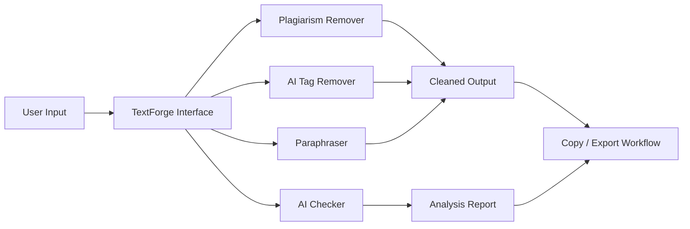

<div align="center">

# ✦ TextForge

### Futuristic AI Writing Cleanup Suite for rewriting, paraphrasing, AI-pattern reduction, and text refinement.

**[Live Link](https://surl.li/zropsz)**


<br/>


</div>

---

## ✨ Overview

**TextForge** is a browser-based AI writing refinement suite designed for fast, clean, and controlled text transformation. It combines multiple writing utilities into one futuristic interface so users can paste content, choose a tool, and instantly generate more polished, natural, and adaptable output.

Built as a **single-file web app**, TextForge removes setup friction completely. No build step, no backend dependency, and no installation barrier — just open the file and start working.

---

## ⚡ Core Modules

| Tool | What it does |
|------|--------------|
| ✦ **Plagiarism Remover** | Rewrites content into a structurally fresh version with preserved meaning and significantly reduced phrase overlap. |
| ⌁ **AI Tag Remover** | Refines robotic or repetitive AI-style wording into more natural, human-sounding prose. |
| ◈ **Paraphraser** | Rephrases text in multiple modes such as Standard, Simplify, Creative, Academic, and Fluent. |
| ⬡ **AI Checker** | Evaluates text signals and returns an AI-likelihood style report with readability and pattern indicators. |

---

## 🌌 Features

- 🚀 Single HTML file architecture.
- 🎛️ Tool-specific option chips for tone, length, and style control.
- 📊 Live word count and quality stats.
- 📋 One-click copy action for output.
- 🌑 Futuristic dark industrial UI with accent-driven styling.
- 📱 Responsive layout for mobile and desktop.
- 🧠 Multi-tool workflow in one screen.
- ⚙️ Zero install and zero build friction.
- 🌐 Deployable on any static host.

---

## 🛠 Tech Stack

<div align="center">


</div>

| Layer | Technology |
|------|------------|
| **Frontend** | Vanilla HTML, CSS, JavaScript |
| **Typography** | Syne + Space Mono |
| **Architecture** | Single-file static application |
| **Hosting** | Vercel, Netlify, GitHub Pages, any static host |

---

## 🧱 Architecture



---

## 🎯 Why It Stands Out

**TextForge** is designed for speed, portability, and a futuristic writing workflow. Instead of splitting features across multiple tools, it centralizes rewriting, cleanup, and analysis into one minimal but powerful interface.

Its single-file structure also makes it ideal for:
- students and researchers,
- content writers and editors,
- marketers and SEO teams,
- developers shipping static tools,
- users who want privacy-friendly client-side workflows.

---

## 🚀 Getting Started

### 1. Clone the repository

```bash
git clone https://github.com/yourusername/textforge.git
cd textforge
```

### 2. Open in your browser

```bash
open ai-text-cleaner.html
```

On Windows, you can simply double-click the file or run:

```bash
start ai-text-cleaner.html
```

No server is required. Open the file directly in any modern browser.

---

## 📁 Project Structure

```bash
textforge/
│
├── ai-text-cleaner.html
└── README.md
```

---

## ⚙️ How It Works

Each module follows a focused transformation or evaluation flow:

- **Plagiarism Remover** applies structural rewriting and phrase-level transformation logic.
- **AI Tag Remover** targets repetitive sentence rhythm, robotic transitions, and predictable wording.
- **Paraphraser** preserves intent while altering style and phrasing based on the selected mode.
- **AI Checker** analyzes writing patterns such as uniformity, burstiness, suspicious phrases, and passive construction signals.

---

## 📦 Deployment

Because **TextForge** is a static application, it can be deployed almost anywhere.

```bash


---

## 🔮 Roadmap

- [ ] Grammar Fixer
- [ ] Tone Changer
- [ ] Summarizer
- [ ] Word Expander
- [ ] History / saved sessions
- [ ] Export as PDF or DOCX

---

## 🤝 Contribution

Contributions are welcome for UI polish, prompt design improvement, performance tuning, and feature expansion.

```bash
git checkout -b feature/futuristic-upgrade
git commit -m "Improve TextForge interface and tool logic"
git push origin feature/futuristic-upgrade
```

---

## 📬 Access

- **Live App:** **[https://surl.li/zropsz](https://surl.li/zropsz)**

---

<div align="center">

### Forge cleaner text. Ship sharper words.

</div>
